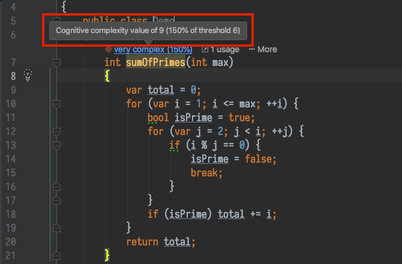

สำหรับหลายๆคน อาจฟังดูเหมือนเรื่องไม่ใหญ่โตอะไร 
แต่สำหรับคนที่ต้องทำงานกับ codebase ที่คนเขียนเยอะๆ
ทำงานกับบริษัทใหญ่ที่มี culture ให้ทุกคนสามารถแก้ไข code ของทีมอื่นได้
หรือ เป็นทีมเจ้าของระบบที่ต้อง review code ของคนอื่นเป็นประจำ
หรือ contribute project open source ต่างๆ
อาจจะประสบพบเจอกับ code จากคนมากหน้าหลายตารวมอยู่ใน project เดียวกัน
ซึ่งแน่นอนว่าทุกคนก็อาจจะไม่ได้ใช้ practice ที่ดีในการแก้ปัญหา
หรือเขียน code ที่ใช้วิธีต่างๆได้ถูกต้อง แต่ code กลับอ่านแล้ว**เข้าใจยาก**

---

### การวัดความซับซ้อนของ code โดยทั่วไป

ย้อนกลับไปในยุคที่การทำ software เริ่มแพร่หลาย การเขียน test นั้นเริ่มเป็นสิ่งที่ทุกคนควรทำ
แต่การเขียน test อาจจะไม่มีประสิทธิภาพ
บางครั้งต้องเขียน test case ในปริมาณที่ "มากเกินไป" ถึงจะครอบคลุมการทำงานทั้งหมด
จึงทำให้คนเริ่มสร้างมาตรฐานในการวัดความซับซ้อนของโปรแกรมขึ้นมา
หนึ่งในนั้นคือ "Cyclomatic Complexity" ที่สร้างขึ้นเมื่อปี 1976

Cyclomatic Complexity สร้างขึ้นด้วยไอเดียการมอง flow ของโปรแกรมเป็น graph
แล้วพิจารณาจำนวน node และ edge ที่เกิดขึ้นและคำนวนเป็น**"แต้ม"** ซึ่งใช้บอกจำนวนของ test case อย่างต่ำ
ที่ต้องเขียนเพื่อให้ test case ครอบคลุมทุก branch (ทางแยกในโปรแกรม เช่น if/loop/try-catch) ใน function นั้นๆ

ตัวอย่างเช่น...

```typescript
function getTransitiveClosure(graph: boolean[][], nodes: number): boolean[][] { // +1
	// Warshall's algorithm
	for (let k = 0; k < nodes; k++) {                                           // +1
		for (let i = 0; i < nodes; i++) {                                       // +1
			for (let j = 0; j < nodes; j++) {                                   // +1
				graph[i][j] = graph[i][j] || (graph[i][k] && graph[k][j]);      // +3
			}
		}
	}	
	return graph;
}
```

function นี้มีแต้ม Cyclomatic Complexity 7 เนื่องจากมี for-loop เป็นทางแยกแล้ว 3
และยังพิจารณา condition ของค่าที่ถูก assign เข้า array อีก
สุดท้ายตัว function declaration เองก็มีมูลค่าอีก 1 แต้ม
เพราะ function เองก็เป็น sub-routine ที่แยกออกมาจาก function ที่เรียกใช้

---

### Cyclomatic Complexity กลายเป็นมาตรฐานไปโดยปริยาย

ในยุคหลังมา การทำ software ร่วมกันกลายเป็นเรื่องปกติและแพร่หลาย โดยเฉพาะในโลกของ Open source
ซึ่งการเขียน code ให้ไม่ซับซ้อนมากจนเกินไปเป็นเรื่องสำคัญ เพราะจะทำให้คนที่ไม่เคยอ่าน code ชุดนั้นมาก่อน
สามารถ "เข้าใจได้ง่าย" และรวดเร็วขึ้น ทำให้ทำงานร่วมกันได้มีประสิทธิภาพมากขึ้น จึงมีคนนำ Cyclomatic Complexity
มาเป็นตัวบ่งชี้ว่า function ใดๆในโปรแกรมมีความซับซ้อนมากเกินไปหรือไม่ 
ถ้ามีมากเกินไปก็จะเป็นสัญญาณให้เจ้าของ code ทำการ "refactor" code นั้นด้วยวิธีต่างๆ
ให้โปรแกรมมีความซับซ้อนน้อยลง จนกลายเป็นเรื่องปกติที่ทุกคนใช้เป็นมาตรฐาน

แต่ตัว Cyclomatic Complexity นี้ยังมีปัญหาบางอย่างที่แก้ไม่ได้
นั่นคือเรื่อง "ความเข้าใจง่ายของ code"

ลอง พิจารณา function นี้...

```typescript
function sumOfPrimes(order: number): number { // +1
    let total = 0;
    for (let i = 1; i <= order; ++i) {        // +1
        let isPrime = true;
        for (let j = 2; j < i; ++j) {         // +1
            if (i % j === 0) {                // +1
                isPrime = false;
                break;
            }
        }
        if (isPrime) total += i;              // +1
    }

    return total;
}
```

จะสังเกตได้ว่า code Cyclomatic Complexity = 5 ซึ่งถ้าพิจารณาตาม flow ของ code
ก็จะพบว่ามี 5 ทางแยกใน function นี้


แต่สุดท้ายแล้วการอ่านเพื่อให้เข้าใจว่าfunctionนี้ทำอะไรได้ค่อนข้างลำบาก เพราะมี `for` ซ้อนกัน
และมี `if` ซ้อนอยู่ข้างในอีก

ทีนี้ลองพิจารณา function นี้บ้าง...
 
```typescript
function getRoughTimeWord(minutesAgo: number): string { // +1
    if (minutesAgo < 1) return "few seconds ago";         // +1
    if (minutesAgo < 10) return "a moment ago";           // +1
    if (minutesAgo < 60) return "about an hour ago";      // +1
    if (minutesAgo < 60 * 24) return "today";             // +1

    return "long time ago";
}
```


function นี้ได้ 5 แต้มเท่ากัน แต่อ่านง่ายกว่ามาก เพราะตัว `if ... return` สามารถอ่านเข้าใจง่ายด้วยตัวมันเองอยู่แล้ว
จึงเป็นปัญหาว่า statement ที่มีความซับซ้อนในการทำงานเพราะสร้างทางแยกเยอะ แต่อ่านแล้วเข้าใจง่าย
กลับถูกให้ค่าความยากเท่ากับ function แรก เพียงเพราะใช้มาตรฐานในการวัดไม่ถูกจุด

---

## Cognitive Complexity มาตรฐานใหม่เพื่อวัดความเข้าใจง่ายของ code
เมื่อการอ่าน code เป็นสิ่งสำคัญ Cognitive Complexity จึงถูกสร้างขึ้นเป็น
metric ที่คำนึงเรื่องความเข้าใจง่ายเป็นหลัก
ดังนั้นการทำงานของ code บาง pattern ที่อาจจะทำงานซับซ้อน
แต่ถ้าตัว statement เองอ่านแล้วเข้าใจได้ทันทีจะไม่เพิ่มแต้มความยากให้

ยกตัวอย่างเดิม function `sumOfPrimes` แต่วัดด้วย Cognitive Complexity

```typescript
function sumOfPrimes(order: number): number {
    let total = 0;
    for (let i = 1; i <= order; ++i) {   // +1
        let isPrime = true;
        for (let j = 2; j < i; ++j) {    // +2
            if (i % j === 0) {           // +3
                isPrime = false;
                break;                   // +1
            }
        }
        if (isPrime) total += i;         // +2
    }

    return total;
}
```

function นี้ Cognitive Complexity = 9 เนื่องจากมี statement ซ้อนกันหลายชั้น วิธี Cognitive Complexity จึงให้แต้มโทษทบยอดลงไปแต่ละชั้น
ดังนั้น ทั้ง `for (let j ...` และ `if (isPrime)` ก็จะถูก +2 ทั้งคู่เพราะตัวมันเองมีความลึก 2
และ `if (i % j === 0)` ก็ถูก +3 เพราะอยู่ชั้น 3 เป็นต้น

ซึ่งถ้าพิจารณาจากภาพของ flow จะให้แต้มดังนี้


เทียบกับ function `getRoughTimeWord`

```typescript
function getRoughTimeWord(minutesAgo: number): string {
    if (minutesAgo < 1) return "few seconds ago";      // +1
    if (minutesAgo < 10) return "a moment ago";        // +1
    if (minutesAgo < 60) return "about an hour ago";   // +1
    if (minutesAgo < 60*24) return "today";            // +1

    return "long time ago";
}
```

กลับกัน function นี้มีคะแนนลดลงไปอีกเพราะไม่ได้นับตัว function เองเป็นความซับซ้อน
ตัว `if` แต่ละเงื่อนไขก็ได้รับอย่างละ 1 แต้ม จึงทำให้มีคะแนนรวมเพียง 4

จะสังเกตได้ว่า Cognitive Complexity จะไม่ได้พึ่งคณิตศาสตร์ (Graph) ในการวัดเหมือน Cyclomatic Complexity
แต่จะให้ความสำคัญกับการอ่าน statement ในแต่ละรูปแบบแทน

ยกตัวอย่างวิธีวัดบางอย่างที่เห็นภาพง่ายๆเช่น...

#### if..else vs shorthand
```typescript
// Case A (Cyclomatic Complexity 2; Cognitive Complexity 2)
let a: string;
if (someVar === valueX) {                 // cyc +1 ; cog +1
    a = "some value";
} else if (anotherVar === valueY) {       // cyc +1 ; cog +1
    a = "another value";
} else {
    a = "other value";
}

// Case B (Cyclomatic Complexity 2; Cognitive Complexity 0)
const b = someVar === valueX             // cyc +1
    ? "some value"
    : anotherVar === valueY              // cyc +1
        ? "another value"
        : "other value";
```
การเขียน `if` ปกตินั้นได้แต้มเพราะการจะเข้าใจว่า statement ในแต่ละ `if` นั้นทำงานอะไรบ้าง
ต้องมองเข้าไปในแต่ละ scope ซึ่งใช้เวลาพอสมควร เพราะแต่ละ scope อาจมีหลาย statement
ต่างกับ shorthand ที่เราสามารถมองรู้เลยว่า value ของตัวแปรจะเป็นค่าใดตามเงื่อนไขที่กำหนด

ดังนั้น shorthand จึงไม่ถูกนับเป็นแต้มความอ่านยาก 
ซึ่งไม่ได้จำกัดเฉพาะ ternary operator (`cond ? val : val`) เท่านั้น
แต่รวมไปถึง shorthand รูปแบบอื่นๆด้วย เช่น
- null-coalescing (`??`) _[Swift, C#, TypeScript (3.7+), JavaScript (ES2020)]_
- optional chaining (`?.`) _[Swift, Kotlin, C#, TypeScript (3.7+), JavaScript (ES2020)]_
- Scala's ternary operator (`val a = if (i == 1) x else y`)

#### if..else vs switch
```typescript
// Case A (Cyclomatic Complexity 4; Cognitive Complexity 3)
function A(param: string): string {                // cyc +1
    if (param === 'create') return createData();   // cyc +1 ; cog +1
    if (param === 'update') return updateData();   // cyc +1 ; cog +1
    if (param === 'delete') return deleteData();   // cyc +1 ; cog +1
    throw new Error('Unknown operation.');
}

// Case B (Cyclomatic Complexity 4; Cognitive Complexity 1)
function B(param: string): string {                      // cyc +1
    switch (param) {                                     //          cog +1
        case 'create': return createData();              // cyc +1
        case 'update': return updateData();              // cyc +1
        case 'delete': return deleteData();              // cyc +1
        default: throw new Error('Unknown operation.');
    }
}
```
เนื่องจาก `switch` ทั้งก้อน เรารู้อยู่แล้วว่าตัวแปรไหนกำลังถูกพิจารณา
ดังนั้นเพียงมองผ่านๆก็รู้แล้วว่า ถ้าตัวแปรมีค่าหนึ่ง แล้วผลลัพธ์ของ function นี้จะเป็นอย่างไร
_(เฉพาะกรณี `switch` แล้ว `return` เลย; ถ้า `switch` แล้ว `break` จะถูกบวกค่าการ break ออกจาก flow)_

ต่างกับ `if` ที่ต้องคอยระวังว่าแต่ละ condition มีหน้่าตาเป็นอย่างไร
กำลังเปรียบเทียบใดอยู่ หรือเป็นตัวแปร flag หรืออื่ีนๆ
จึงทำให้มีแต้มความยากในการแต่ละ condition

นี่เป็นเพียงตัวอย่างคร่าวๆ 
สำหรับรายละเอียดของการนับแต้ม Cognitive Complexity 
ทั้งหมดสามารถอ่านเต็มๆได้จาก white paper ที่ reference ข้างล่าง

---

### Cognitive Complexity ในการใช้งานจริง
มี tool แค่ไม่กี่ตัว (เท่าที่รู้จัก) ที่วัด Cognitive Complexity ได้
แต่หนึ่งในนั้นมี ESLint ซึ่งก็ทำให้ชาว JavaScript/TypeScript อุ่นใจแล้ว
 
#### Lint tools
1. SonarQube
2. ESLint [(plugin `eslint-plugin-sonarjs`)](https://github.com/SonarSource/eslint-plugin-sonarjs)


#### IDE inspection tool
1. CongitiveComplexity [(JetBrains Rider plugin)](https://plugins.jetbrains.com/plugin/12024-cognitivecomplexity) _(supports C# only)_


---

ซึ่งลำพังตัว Cognitive Complexity เองนั้นเป็นเพียง metric บอกความยากในการอ่าน
แต่ถ้าพึ่ง Cognitive Complexity อย่างเดียว อาจจะทำให้เกิดเคสที่อ่านง่าย แต่เขียน test ยาก
เช่นมี switch case หรือ shorthand operators เต็มไปหมด ซึ่งอาจทำให้ Cognitive Complexity น้อย
แต่ function มีทางแยกเยอะมาก จนอาจจะเขียน test ได้ไม่ครบทุกเคส จึงอาจจะนำ
Cyclomatic Complexity มาร่วมเป็น metric อีกตัว แล้วตั้ง threshold ของทั้ง 2 ตัวให้สมเหตุสมผล
เพื่อให้ function อ่านได้ไม่ยากเกินไป และ เทสได้ไม่ยากเกินไป

ps. สำหรับใครที่ยังไม่เข้าใจว่า lint tools คืออะไร ใช้งานอย่างไร หรือมีประโยชน์อย่างไร
ตอนต่อไปจะอธิบายถึงการใช้ lint tools สำหรับทั้ง project ทำคนเดียวและที่ทำร่วมกันให้มีประสิทธิภาพ
ฝากติดตามด้วย ;)

---

#### Reference
1. [Cognitive Complexity: A new way of measuring understandability, G. Ann Campbell](https://www.sonarsource.com/docs/CognitiveComplexity.pdf)
